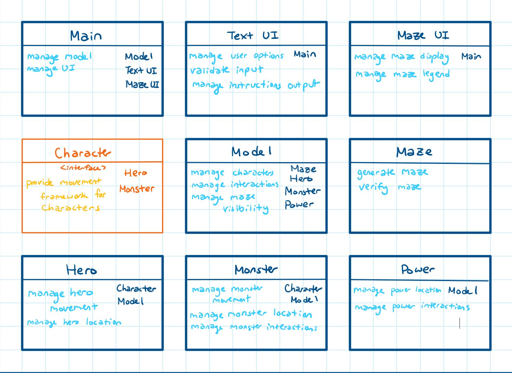
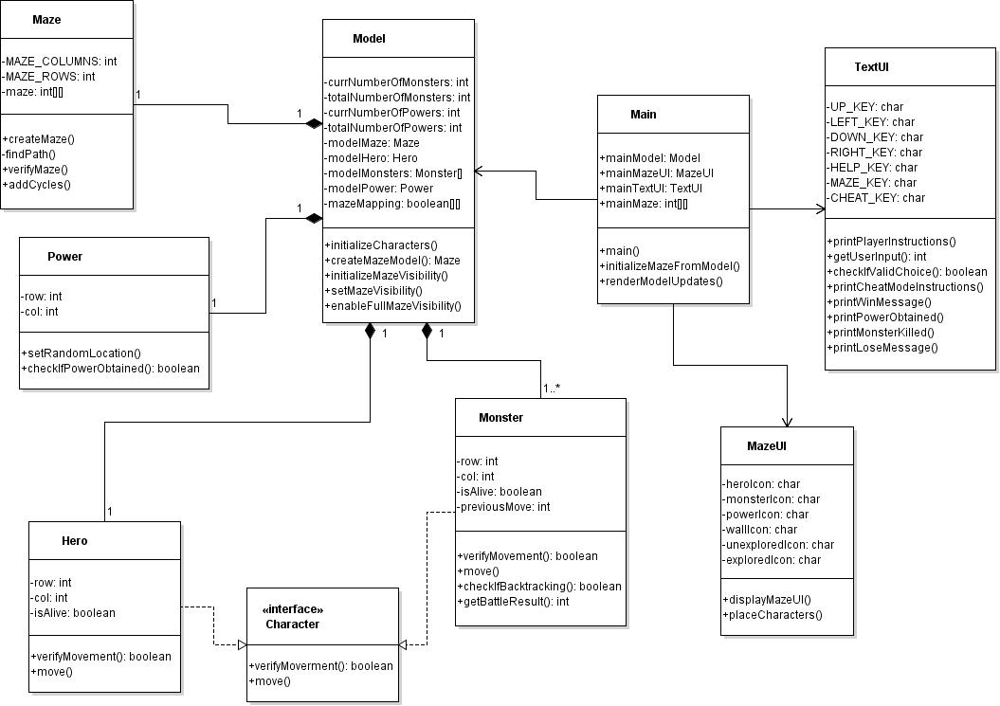
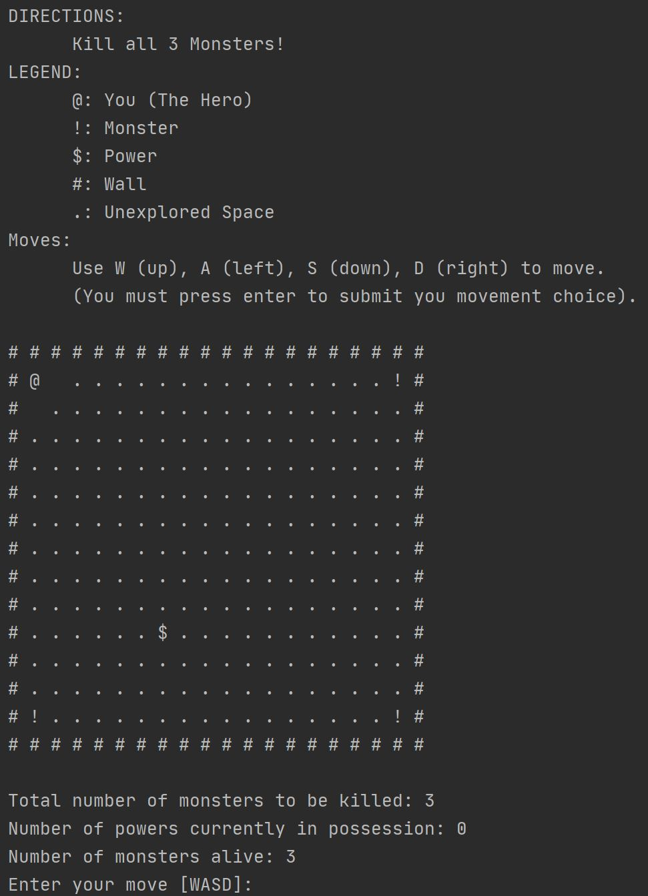
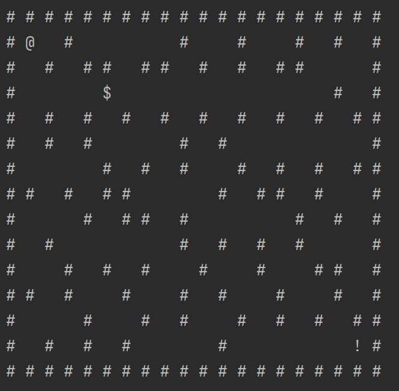
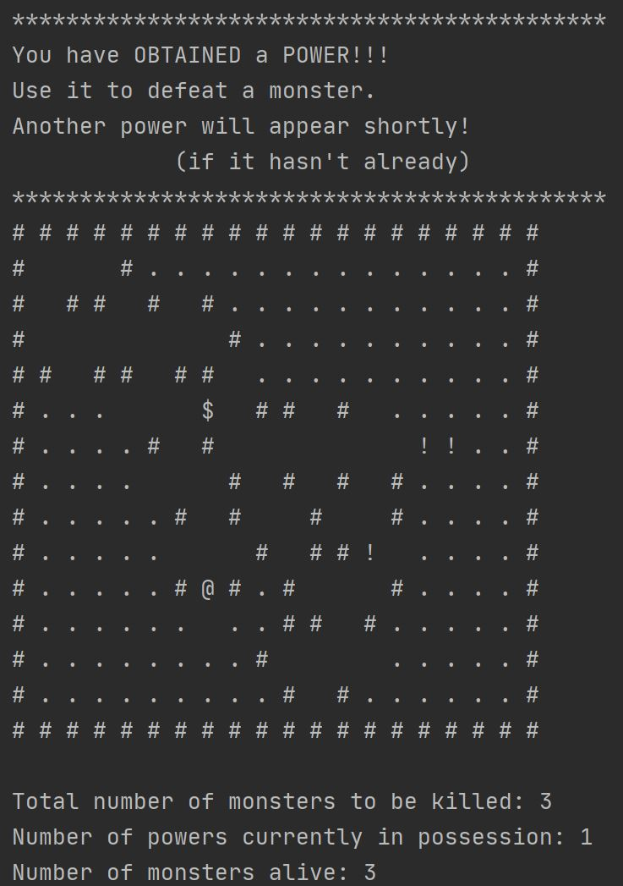
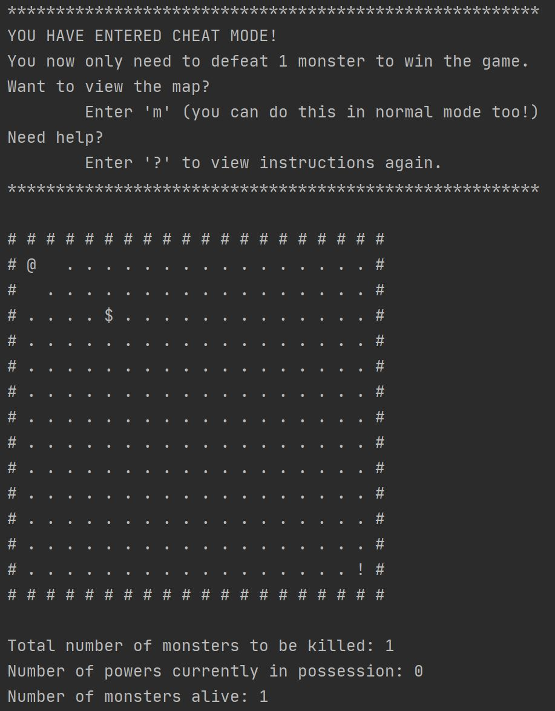
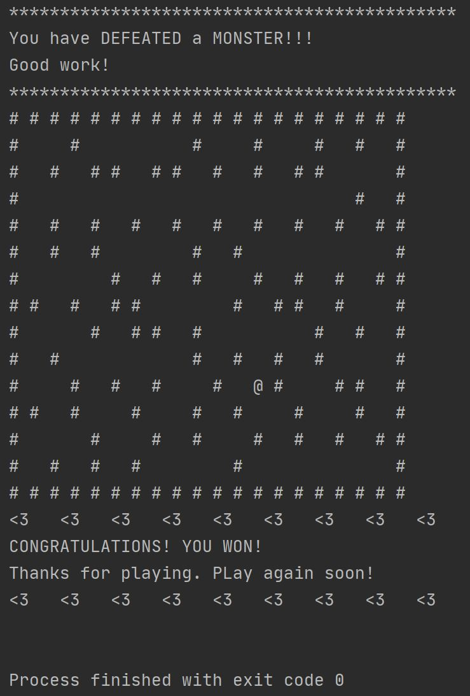

# Java-AnAmazingGame
A Maze Game created for SFU's CMPT213, taught by Victor Cheung, Summer 2020.The course focus was on Object-Oriented Design (OOD) using Java Programming. The course included inheritance, polymorphism, interfaces, and abstract classes, as well as best practices for code construction and an introduction to programming event driven graphical user interfaces (GUI).

This repository includes assignment 2 from the course, roughly two months into the 4 month term.

## Game Details
- The user collects powers while traversing a maze, in order to kill monsters
- To collect a power of kill a monster, the player must occupy the same space as the object of choice
- Monsters move pseudo-randomly (avoid backtracking) without knowledge of the hero's location
- The maze has a top down display with walls initially hidden
  - Maze walls become visible when the player is adjacent to them 

## My Maze Generation Logic
**Maze Generation Rules: **
    1. Monsters spawn in the four corners, so no walls there
    2. There must be multiple paths through the maze
    3. No closed off rooms, only paths
    4. There must not be a 2x2 of walls or cells

## Components and Tools
- This Repository includes **Class-Responsibility-Collaborator (CRC) Cards** for this project's **Object-Oriented Design (OOD)**

- I also created a **Unified Modeling Language (UML)** Class Diagram

## Version Specifics
*gson library from com.google.code.gson*

Uses:
- Java **14.0.1**
- Json ~~gson~~ **2.8.6**
- IntelliJ IDEA Community Edition **2020.1.1**

## Example Gameplay - User Interface (UI)
### Game Startup and Menu

### A Fully Generated Maze Layout

### Power Up Interaction

### Cheat Mode

### A Finished Game - Win

## Resources
- Brian Fraser's [Deserializing JSON tutorial](https://youtu.be/HSuVtkdej8Q)
- Marvel Heroes' [Height scale](https://marvel.fandom.com/wiki/Height_Scale)
- DC Heroes' [Height Scale](https://dc.fandom.com/wiki/Category:Height)

